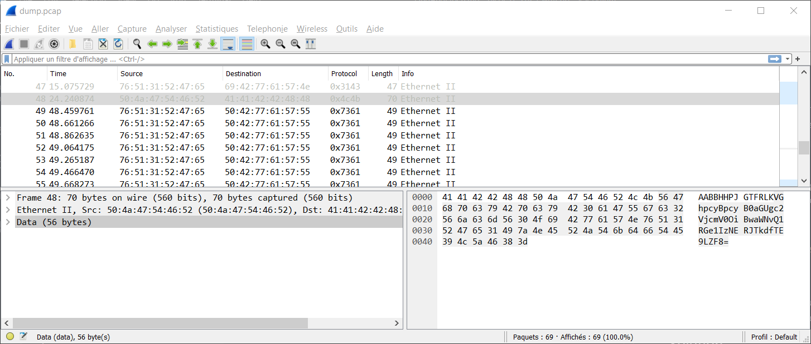

# FindAndOpen

## Enoncé
Catégorie : [Forensics](../)

Points : 200

Tags : 

Description :
> Someone might have hidden the password in the trace file.  
> Find the key to unlock this file. This tracefile might be good to analyze.

Hints :
1. Download the pcap and look for the password or flag.
2. Don't try to use a password cracking tool, there are easier ways here.


## Approche

On dispose d'une archive `flag.zip` contenant un fichier `flag` protégé par un mot de pase, ainsi qu'un dump de trames réseaux via le fichier `dump.pcap`.

Le mot de passe permettant d'ouvrir le fichier `flag` est surement dissimulé quelque part dans les trames réseaux.

## Solution

A l'aide de Wireshark, on peut parcourir les trames fournis dans le fichier `dump.pcap`.

On y trouve des informations intéressantes :
* trames 1 à 9 : `Flying on Ethernet secret: Is this the flag`
* trames 23 à 47 : `Could the flag have been splitted ?`
* trame 48 : `VGhpcyBpcyB0aGUgc2VjcmV0OiBwaWNvQ1RGe1IzNERJTkdfTE9LZF8=`

* trames 58 à 65 : `Maybe try checking the other file`

Les données de la trame 48 font penser à un encodage en base64 :
```bash
$ base64 -d <<< VGhpcyBpcyB0aGUgc2VjcmV0OiBwaWNvQ1RGe1IzNERJTkdfTE9LZF8=

This is the secret: picoCTF{R34DING_LOKd_
```

On utilise le secret ainsi obtenu comme mot de passe pour ouvrir le fichier `flag` contenu dans le ZIP.

Le fichier `flag` contient le flag à trouver.
