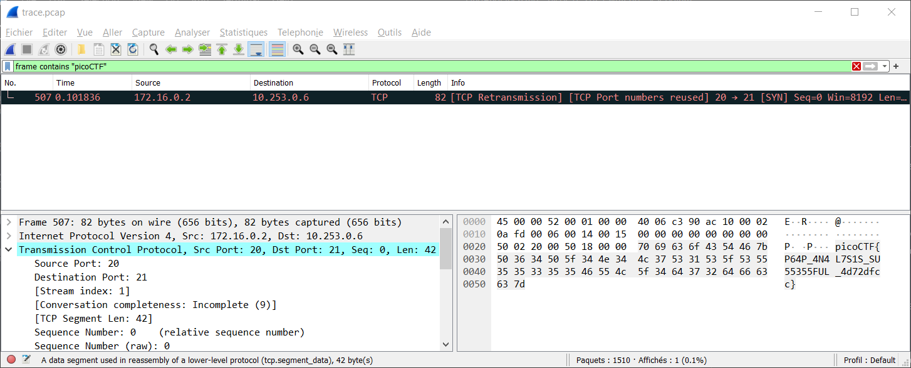

# PcapPoisoning

## Enoncé
Catégorie : [Forensics](../)

Points : 100

Tags : `pcap`

Description :
> How about some hide and seek heh?  
> Download this file and find the flag.

## Approche

On utilise Wireshark pour analyser le fichier `trace.pcap` fourni.

## Solution

A l'aide de Wireshark, on cherche des trames susceptibles de contenir le flag, à savoir contenant une chaîne de caractères contenant picoCTF.

On peut parcourir les trames une à une et regarder si on trouve quelque chose d'intéressant.

Autre possibilité, utiliser le filtre : `frame contains "picoCTF"`

Dans tous les cas, on trouve le flag au niveau de la trame 507 :

