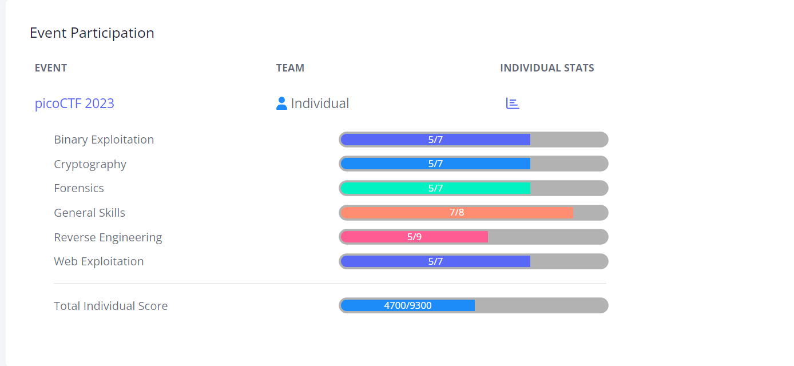

# picoCTF 2023

Voici les réflexions menées lors de ma participation en individuel au picoCTF 2023 pour résoudre les [challenges proprosés](https://play.picoctf.org/practice?originalEvent=72). 
Le CTF s'est déroulé du 14 au 28 mars 2023 en ligne.

## Résultat

## Challenges

<table>
 <thead><tr><th>Catégorie</th><th>Challenge</th><th>Points</th><th>Résolu</th></tr></thead>
 <tbody>
   <tr><td rowspan=7>Binary Exploitation</td>
         <td><a href="./Binary Exploitation/babygame01/babygame01.md">babygame01</a></td><td>100</td><td>:heavy_check_mark:</td>
     <tr><td><a href="./Binary Exploitation/two-sum/two-sum.md">two-sum</a></td><td>100</td><td>:heavy_check_mark:</td>
     <tr><td>babygame02</td><td>200</td><td>:x:</td>
     <tr><td><a href="./Binary Exploitation/hijacking/hijacking.md">hijacking</a></td><td>200</td><td>:heavy_check_mark:</td>
     <tr><td><a href="./Binary Exploitation/tic-tac/tic-tac.md">tic-tac</a></td><td>200</td><td>:heavy_check_mark:</td>
     <tr><td><a href="./Binary Exploitation/VNE/VNE.md">VNE</a></td><td>200</td><td>:heavy_check_mark:</td>
     <tr><td>Horsetrack</td><td>300</td><td>:x:</td>
   <tr><td rowspan=7>Cryptography</td>
         <td><a href="./Cryptography/HideToSee/HideToSee.md">HideToSee</a></td><td>100</td><td>:heavy_check_mark:</td>
     <tr><td><a href="./Cryptography/ReadMyCert/ReadMyCert.md">ReadMyCert</a></td><td>100</td><td>:heavy_check_mark:</td>
     <tr><td><a href="./Cryptography/rotation/rotation.md">rotation</a></td><td>100</td><td>:heavy_check_mark:</td>
     <tr><td><a href="./Cryptography/PowerAnalysis_Warmup/PowerAnalysis_Warmup.md">PowerAnalysis: Warmup</a></td><td>200</td><td>:heavy_check_mark:</td>
     <tr><td>PowerAnalysis: Part 1</td><td>400</td><td>:x:</td>
     <tr><td><a href="./Cryptography/SRA/SRA.md">SRA</a></td><td>400</td><td>:heavy_check_mark:</td>
     <tr><td>PowerAnalysis: Part 2</td><td>500</td><td>:x:</td>
   <tr><td rowspan=7>Forensics</td>
         <td><a href="./Forensics/hideme/hideme.md">hideme</a></td><td>100</td><td>:heavy_check_mark:</td>
     <tr><td><a href="./Forensics/PcapPoisoning/PcapPoisoning.md">PcapPoisoning</a></td><td>100</td><td>:heavy_check_mark:</td>
     <tr><td><a href="./Forensics/who is it/who is it.md">who is it</a></td><td>100</td><td>:heavy_check_mark:</td>
     <tr><td><a href="./Forensics/FindAndOpen/FindAndOpen.md">FindAndOpen</a></td><td>200</td><td>:heavy_check_mark:</td>
     <tr><td><a href="./Forensics/MSB/MSB.md">MSB</a></td><td>200</td><td>:heavy_check_mark:</td>
     <tr><td>Invisible WORDs</td><td>300</td><td>:x:</td>
     <tr><td>UnforgottenBits</td><td>500</td><td>:x:</td>
   <tr><td rowspan=8>General Skills</td>
         <td><a href="./General Skills/chrono/chrono.md">chrono</a></td><td>100</td><td>:heavy_check_mark:</td>
     <tr><td><a href="./General Skills/money-ware/money-ware.md">money-ware</a></td><td>100</td><td>:heavy_check_mark:</td>
     <tr><td><a href="./General Skills/Permissions/Permissions.md">Permissions</a></td><td>100</td><td>:heavy_check_mark:</td>
     <tr><td><a href="./General Skills/repetitions/repetitions.md">repetitions</a></td><td>100</td><td>:heavy_check_mark:</td>
     <tr><td><a href="./General Skills/Rules 2023/Rules 2023.md">Rules 2023</a></td><td>100</td><td>:heavy_check_mark:</td>
     <tr><td><a href="./General Skills/useless/useless.md">useless</a></td><td>100</td><td>:heavy_check_mark:</td>
     <tr><td><a href="./General Skills/Special/Special.md">Special</a></td><td>300</td><td>:heavy_check_mark:</td>
     <tr><td>Specialer</td><td>400</td><td>:x:</td>
   <tr><td rowspan=9>Reverse Engineering</td>
         <td><a href="./Reverse Engineering/Ready Gladiator 0/Ready Gladiator 0.md">Ready Gladiator 0</a></td><td>100</td><td>:heavy_check_mark:</td>
     <tr><td><a href="./Reverse Engineering/Reverse/Reverse.md">Reverse</a></td><td>100</td><td>:heavy_check_mark:</td>
     <tr><td><a href="./Reverse Engineering/Safe Opener 2SB/Safe Opener 2.md">Safe Opener 2</a></td><td>100</td><td>:heavy_check_mark:</td>
     <tr><td><a href="./Reverse Engineering/timer/timer.md">timer</a></td><td>100</td><td>:heavy_check_mark:</td>
     <tr><td>Virtual Machine 0</td><td>100</td><td>:x:</td>
     <tr><td>No way out</td><td>200</td><td>:x:</td>
     <tr><td><a href="./Reverse Engineering/Ready Gladiator 1/Ready Gladiator 1.md">Ready Gladiator 1</a></td><td>200</td><td>:heavy_check_mark:</td>
     <tr><td>Virtual Machine 1</td><td>300</td><td>:x:</td>
     <tr><td>Ready Gladiator 2</td><td>400</td><td>:x:</td>
   <tr><td rowspan=7>Web Exploitation</td>
         <td><a href="./Web Exploitation/findme/findme.md">findme</a></td><td>100</td><td>:heavy_check_mark:</td>
     <tr><td><a href="./Web Exploitation/MatchTheRegex/MatchTheRegex.md">MatchTheRegex</a></td><td>100</td><td>:heavy_check_mark:</td>
     <tr><td><a href="./Web Exploitation/SOAP/SOAP.md">SOAP</a></td><td>100</td><td>:heavy_check_mark:</td>
     <tr><td><a href="./Web Exploitation/More SQLi/More SQLi.md">More SQLi</a></td><td>200</td><td>:heavy_check_mark:</td>
     <tr><td><a href="./Web Exploitation/Java Code Analysis/Java Code Analysis.md">Java Code Analysis!?!</a></td><td>300</td><td>:heavy_check_mark:</td>
     <tr><td>cancri-sp</td><td>500</td><td>:x:</td>
     <tr><td>msfroggenerator2</td><td>500</td><td>:x:</td>
 </tbody>
</table>

