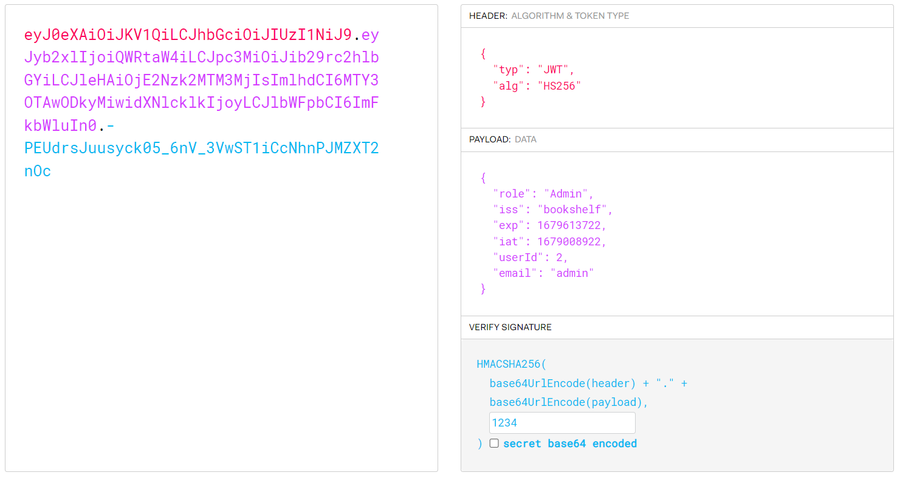

# Java Code Analysis

## Enoncé
Catégorie : [Web Exploitation](../)

Points : 300

Tags :

Description :
> BookShelf Pico, my premium online book-reading service.  
> I believe that my website is super secure. I challenge you to prove me wrong by reading the 'Flag' book!  
> Here are the credentials to get you started:  
> Username: "user"  
> Password: "user"  
> Source code can be downloaded here.  
> Website can be accessed here!.

Hints :
1. Maybe try to find the JWT Signing Key ("secret key") in the source code? Maybe it's hardcoded somewhere? Or maybe try to crack it?
2. The 'role' and 'userId' fields in the JWT can be of interest to you!
3. The 'controllers', 'services' and 'security' java packages in the given source code might need your attention. We've provided a README.md file that contains some documentation.
4. Upgrade your 'role' with the new (cracked) JWT. And re-login for the new role to get reflected in browser's localStorage.


## Approche

On s'authentifie avec l'identifiant `user` et le mot de passe `user` fournis :


On peut alors télécharger des fichiers PDF via des URL de la forme `GET /base/books/pdf/3`

Le fichier qui nous intéresse semble être celui récupérable avec l'URL `GET /base/books/pdf/5` :


On voit dans la vue Network des DevTools du navigateur, que les appels HTTP comportent un header `Authorization` de type JWT.

On peut utiliser par exemple le site [jwt.io](https://jwt.io/) pour le décoder :


Il faudrait pouvoir forger ce token afin d'obtenir des privilèges plus élévés.


## Solution

On note que l'algorithme utilisé est HS256, donc la signature et sa vérification s'appuient sur le même mot de passe.

L'analyse des sources fournies montre que ce secret est généré au niveau de la classe `SecretGenerator`, via la méthode :
```java
private String generateRandomString(int len) {
    // not so random
    return "1234";
}
```

Par conséquent, le mot de passe est `1234`.
Si on l'applique au token obtenu précédemment, on vérifie bien qu'on obtient la même signature.

On peut donc maintenant forger un token pour obtenir des droits plus élévés.

La classe `BookShelfConfig` responsable de la création des données utilisateurs, nous permet de comprendre les informations à utiliser :
* role : Admin
* email : admin
* userId : 2

On utilise ces informations pour forger un token :


On utilise alors ce token pour requêter `GET /base/books/pdf/5` par exemple avec `curl`.
En retour on obtient un fichier `flag.pdf` contenant le flag
