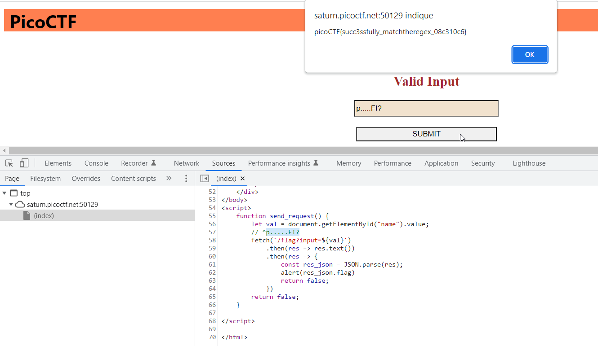

# MatchTheRegex

## Enoncé
Catégorie : [Web Exploitation](../)

Points : 100

Tags : 

Description :
> How about trying to match a regular expression  
> The website is running here.

Hints :
1. Access the webpage and try to match the regular expression associated with the text field

## Approche

La page web présente un formulaire avec un uniquement champ. Il faut trouver la bonne valeur à soumettre.

## Solution

L'examen du code source de la page, montre un commentaire de type expression régulière juste avant la fonction utilisée pour soumettre le formulaire.

Si on soumet celle-ci (i.e. `p.....F!?`), le flag apparaît en retour dans une popup :

