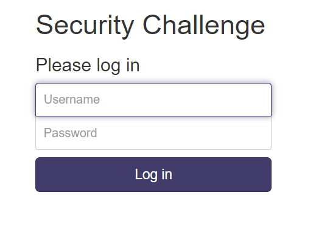
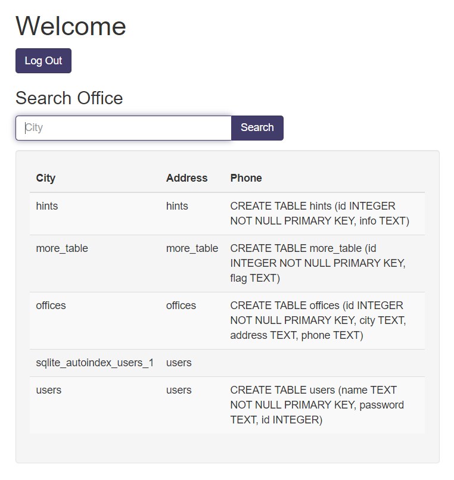

# More SQLi

## Enoncé
Catégorie : [Web Exploitation](../)

Points : 200

Tags : `sql`

Description :
> Can you find the flag on this website.  
> Try to find the flag here.

Hints :
1. SQLiLite

## Approche

Le site Web présente un formulaire de connexion classique :

On soumet le formulaire avec :
* identifiant : `a`
* mot de passe : `a`

En retour, on obtient une page d'erreur montrant la requête SQL exécutée :

Visiblement, l'exploitation d'une injection SQL est possible.

## Solution

On soumet le formulaire de connexion avec :
* identifiant : `a`
* mot de passe : `' OR 1=1 -- `

On arrive alors sur la page d'accueil :

On essaie maintenant de déterminer le nombre de colonnes retournées par la requête sous-jacente.
Une recherche avec le critère `' or 1=1 order by 3 -- ` renvoie le même résultat, mais trié par numéro de téléphone :

Par contre, avec le critère `' or 1=1 order by 4 -- `, le résultat est vide :

Il y a donc uniquement 3 colonnes dans la requête. Par conséquent l'utilisation d'une `UNION` devra se faire avec une requête renvoyant uniquement aussi 3 colonnes.

Pour rappel, la page d'erreur de connexion montrait l'existence de la table `users` avec 3 colonnes (au moins) : `id`, `username` et `password`.
On utilise donc le critère `' UNION SELECT * from users -- ` pour extraire les données des utilisateurs :

Fausse piste : il s'avère que ce n'est pas le flag recherché.

L'indice fourni indique que la base utilisée est une base SQLite.
On va donc pouvoir s'appuyer sur la table interne `sqlite_master` pour obtenir des informations sur la structure de la base.

Pour cela, on utilise le critère de recherche `' UNION SELECT name,tbl_name,sql FROM sqlite_master; -- `:

La table `more_table` avec la colonne `flag` attire l'attention.
On utilise donc le critère `' UNION SELECT id, flag, 3 FROM more_table; -- ` pour en connaître le contenu et récupérer le flag :

