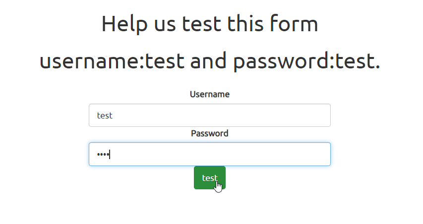
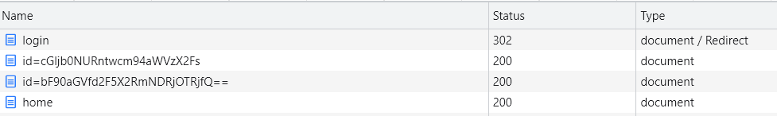

# findme

## Enoncé
Catégorie : [Web Exploitation](../)

Points : 100

Tags : 

Description :
> Help us test the form by submiting the username as test and password as test!  
> The website running here.

Hints :
1. any redirections?


## Approche

L'URL fournie présente un formulaire de connexion :


Si on utilise l'identifiant `test` et le mot de passe `test!` indiqués dans l'énoncé, on est alors redirigé vers une page d'accueil.

## Solution

On regarde les appels HTTP réalisés lors de l'authentification, via la vue Network des DevTools du navigateur.



Parmi les appels les 2 en `/id=xxx` retiennent notre attention.
* /next-page/id=cGljb0NURntwcm94aWVzX2Fs
* /next-page/id=bF90aGVfd2F5X2RmNDRjOTRjfQ==

Le décodage en base64 de la concaténation des 2 `id` permet d'obtenir le flag :
```bash
$ base64 -d <<< cGljb0NURntwcm94aWVzX2FsbF90aGVfd2F5X2RmNDRjOTRjfQ==

picoCTF{proxies_all_the_way_df44c94c}
```
